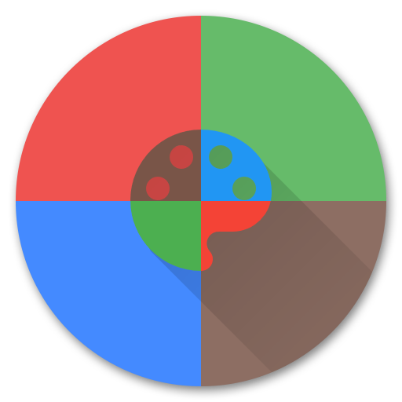

# Color Reference

"A little rusty on your color theory? Material design makes color easy."

Color Reference helps you choose a nice primary color for your new app.

To learn more, please visit
https://www.google.com/design/spec/style/color.html#

Copyright &#169; 2016 By_syk. All rights reserved.