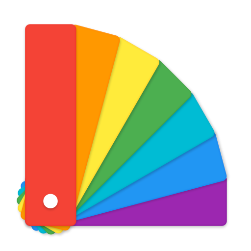
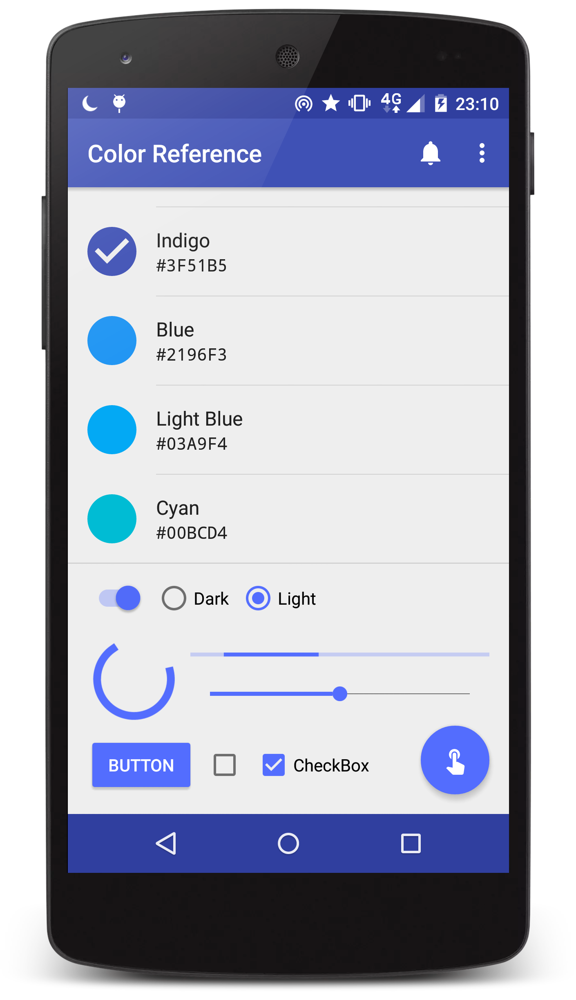

# Color Reference - Material color palette

### Description

`"A little rusty on your color theory? Material design makes color easy."`   
— Google says.
   
**Color Reference** helps you choose a nice primary color for your new Android app.

* To learn more, please visit Google's   
[https://www.google.com/design/spec/style/color.html](https://www.google.com/design/spec/style/color.html "Material design - Color")

* To do it online, please visit MaterialUp's   
[http://www.materialpalette.com](http://www.materialpalette.com "Material Design Color Palette Generator - Material Palette")

### Download APK

* Get it
   * on [Google Play](https://play.google.com/store/apps/details?id=com.by_syk.mdcolor "Color Reference")
   * on [Cool Market](http://www.coolapk.com/apk/com.by_syk.mdcolor "Color Reference")
   * [here](art/com.by_syk.mdcolor.apk "Color Reference")

### Changelog

* View it [here](CHANGELOG.txt "Changelog").

### Contact author

* E-mail: [By_syk@163.com](mailto:By_syk@163.com "By_syk")

### License

    Copyright 2016-2017 By_syk

    Licensed under the Apache License, Version 2.0 (the "License");
    you may not use this file except in compliance with the License.
    You may obtain a copy of the License at

       http://www.apache.org/licenses/LICENSE-2.0

    Unless required by applicable law or agreed to in writing, software
    distributed under the License is distributed on an "AS IS" BASIS,
    WITHOUT WARRANTIES OR CONDITIONS OF ANY KIND, either express or implied.
    See the License for the specific language governing permissions and
    limitations under the License.

*Copyright &#169; 2016-2017 By_syk. All rights reserved.*